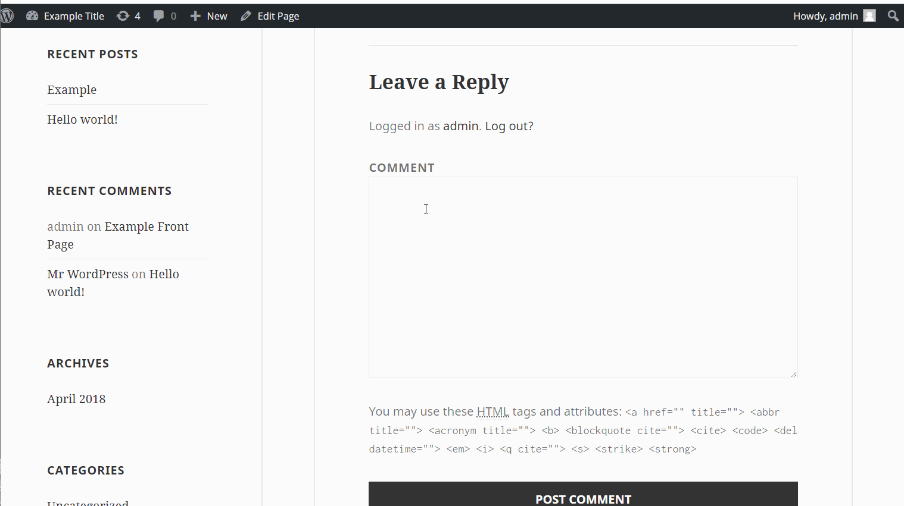

# Week-7-Project-WordPress-vs.-Kali

1. (Required) User Enumeration
  - [x] Summary: 
    - Vulnerability types: User Enumeration
    - Tested in version: Word Press 4.2
    - Fixed in version: 
  - [x] GIF Walkthrough: 

  - [x] Steps to recreate: Logging into word press is a vulnerability that allows anyone the ability to enumerate a list of valid user names on a WordPress site. you simply type admin and the wrong password and a prompt will tell you that there is an admin account which will make it easier to brute force that account's password. 
  - [ ] Affected source code:
    - [Link 1](https://core.trac.wordpress.org/browser/tags/version/src/source_file.php)
    
    
1. (Required) XSS
  - [x] Summary: 
    - Vulnerability types: XSS
    - Tested in version: Word Press 4.2
    - Fixed in version: patched WordPress 4.6.1
  - [x] GIF Walkthrough: 
  - [x] Steps to recreate: Appon leaving a comment there is a vunribulity where if you enter code in you can get a link to pop up in the comment section who may proceed to embed cross site scripting on their post. This may be used for privilege escalation if users of admin privileges were to view the pages.
  - [ ] Affected source code:
    - [Link 1](https://core.trac.wordpress.org/browser/tags/version/src/source_file.php)
    
    
1. (Required) CSRF
  - [x] Summary: 
    - Vulnerability types: CSRF
    - Tested in version: 4.2
    - Fixed in version: 4.2.1
  - [x] GIF Walkthrough:  
  - [x] Steps to recreate: When trying to reply to a comment when you enter in the script into the comment will enter in to an infinate loop of saying you have already commented what you said, untill the admin deletes that comment you will not be able to go back to the page.  
  - [ ] Affected source code:
    - [Link 1](https://core.trac.wordpress.org/browser/tags/version/src/source_file.php)
    
