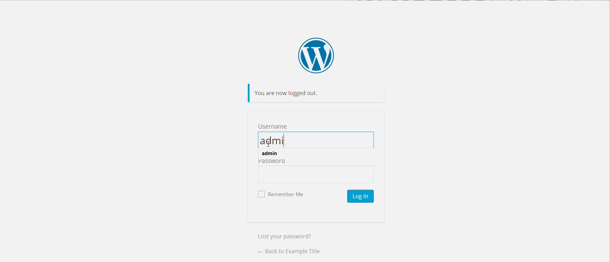

# Week-7-Project-WordPress-vs.-Kali

1. (Required) Vulnerability Name
  - [x] Summary: 
    - Vulnerability types: User Enumeration
    - Tested in version: Word Press 4.2
    - Fixed in version: 
  - [x] GIF Walkthrough: 

  - [x] Steps to recreate: Logging into word press is a vulnerability that allows anyone the ability to enumerate a list of valid user names on a WordPress site. you simply type admin and the wrong password and a prompt will tell you that there is an admin account which will make it easier to brute force that account's password. 
  - [ ] Affected source code:
    - [Link 1](https://core.trac.wordpress.org/browser/tags/version/src/source_file.php)
    
    
1. (Required) Vulnerability Name
  - [ ] Summary: 
    - Vulnerability types: 
    - Tested in version: 
    - Fixed in version: 
  - [ ] GIF Walkthrough: 
  - [ ] Steps to recreate: 
  - [ ] Affected source code:
    - [Link 1](https://core.trac.wordpress.org/browser/tags/version/src/source_file.php)
    1. (Required) Vulnerability Name
  - [ ] Summary: 
    - Vulnerability types: 
    - Tested in version: 
    - Fixed in version:
  - [ ] GIF Walkthrough: 
  - [ ] Steps to recreate: 
  - [ ] Affected source code:
    - [Link 1](https://core.trac.wordpress.org/browser/tags/version/src/source_file.php)
    
